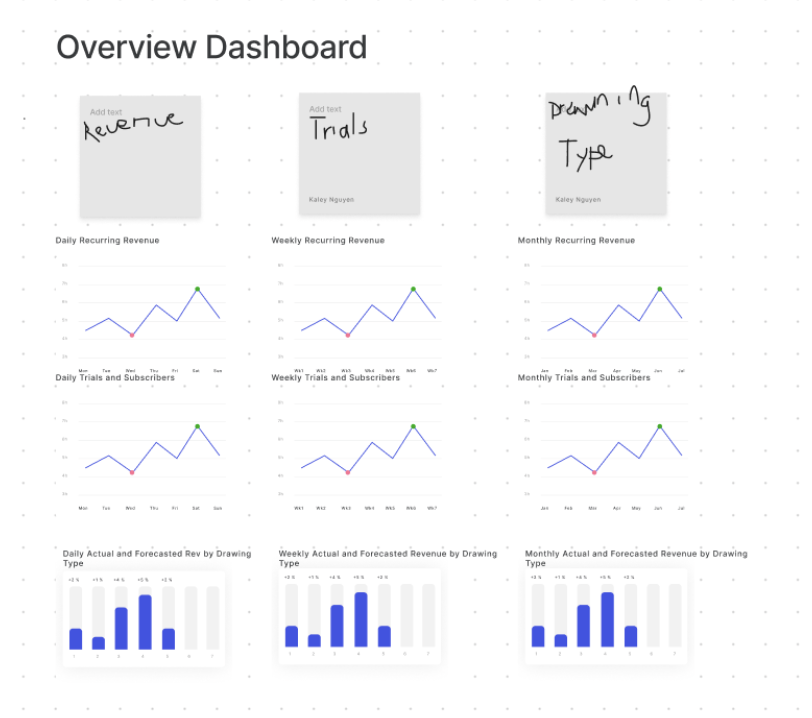

# Dashboard mockup


# High level: revenue, trials and product feature
* Revenue with the assumption that a customer is actively paying throughout the entire time period. 
```sql
SELECT  subscription_version
        ,SUM(subscription_amount)
FROM dim_subscriptions
GROUP BY 1
```
* Number of trials
```sql
SELECT  subscription_version
        ,COUNT(CASE WHEN is_trial = 1 THEN 1 ELSE 0 END) AS n_trials
FROM dim_subscriptions
GROUP BY 1
```
* Group by product features / drawing type from largest revenue to lowest revenue
```sql
SELECT drawing_type
        , SUM(subscription_amount) 
FROM dim_subscriptions
    JOIN dim_customers USING(customer_id)
    JOIN dim_projects USING(project_id)
    JOIN dim_drawings USING(project_id)
GROUP BY 1
ORDER BY 2 DESC
```

# Low level: how the customers are using the product
Using function `date_spine` in `dbt_utils` packaage to spread the date data from from wide to long so each row is one record per month, rather than one record per active subscription:

Assumptions:

* The grain of the DRR is `date_day`, WRR is `date_week` and MRR is `date_month`
* The start day of the spine is the minimum start day of all the subscriptions, which is 2018-01-01
* The end date would be the end of the current month 

## materialized `util_days` model into utils folder
```sql
 SELECT *  
    FROM {{ dbt_utils.date_spine(
    datepart="day",
    start_date = "2018-01-01", 
    end_date = "date_trunc('month', getdate()) + INTERVAL '1 month'"}} 
```

## materialized `daily_active_subscription` model into analytics folder
```sql
with subs as (
    select * from {{ ref('dim_subscriptions') }}
),
util_days as (
    select * from {{ ref('util_days') }}
),
spined as (
    select 
        subs.subscription_id,
        subs.customer_id,
        subs.subscription_version,
        util_days.date_day
    from subs
    left join util_days
        -- start date is before the date we want in our table
        on subs.start_date <= util_days.date_day
        -- end date is after the date we want in our model, or there is no end date
        and (subs.end_date >= util_days.date_day or subs.end_date is null)
)
select * from spined
```

## materialized `summary_daily_active_subscription` and feed into BI tools
```sql
select
    date_day,
    count(subscription_id) as n_active_subscriptions,
    count(case when subscription_version='1.0.0' then subscription_id end) as n_active_first_version_subscriptions,
    count(case when subscription_version='2.0.0' then subscription_id end) as n_active_second_version_subscriptions,
    count(distinct customer_id) as n_distinct_users_with_subscriptions
from analytics.daily_active_subscription
group by 1
```
# Scorecard: I am working on this
* churning
* likelihood to convert to paying customers
