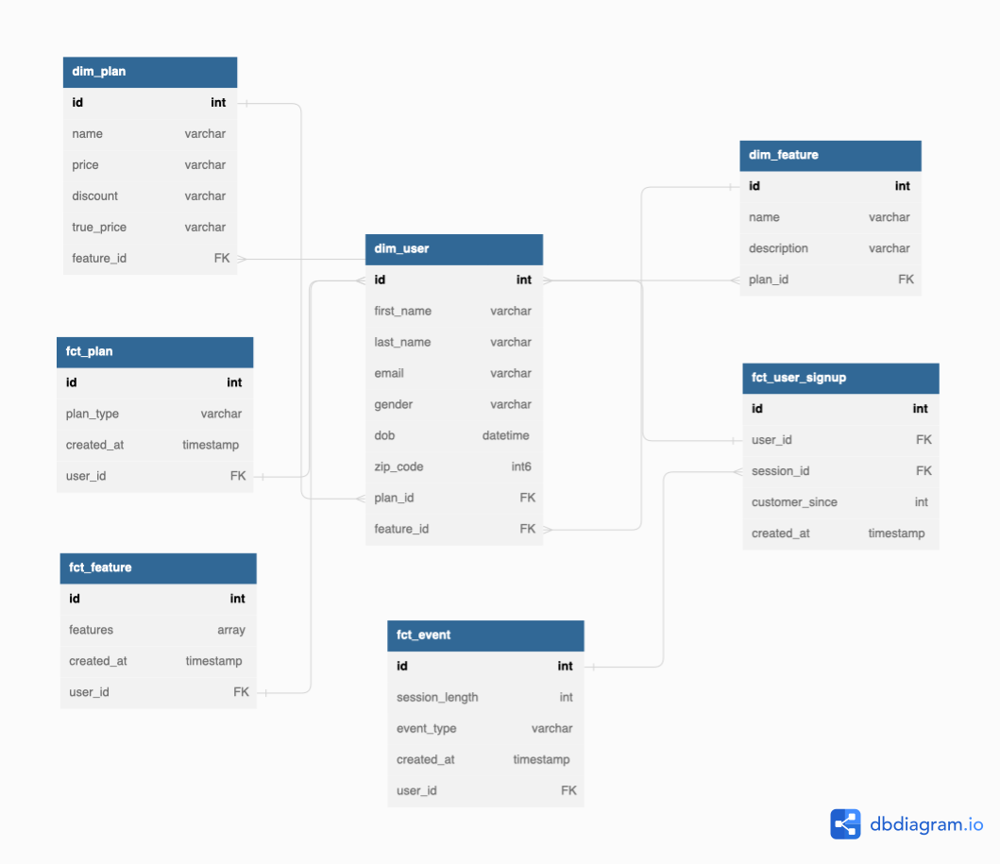

# Project Assumptions
* Only personal github account without any tie to a specific organization
* Upgrading to a paid plan requires explicit process and all the users start with a free account. 
# Logical Model

## Step 1: select the business process
1. Sign up for a free account
2. Convert from a free account to a paid account
3. Develop features that users like

## Step 2: declare the grain
|Business Process | Grain |
|---|---|
|Acquiring new users| user sign up with timestamp|
|Converting to a paid account| user changes from free to paid|
| Strategy for adding new features | market research, user survey, analyze converted/non-converted users |

## Step 3: identify dims
* Users
* Features
* Plans

## Step 4: identify facts
* fact_user_signup
* fact_plan
* fact_feature

# ER


# Business Questions
* How many new accounts signed up daily?
```sql
```
* How long does it take for an account to convert from a free account?
```sql
```
* Which features do paid accounts tend to use more frequently than non-converted acccounts?
```sql
```
